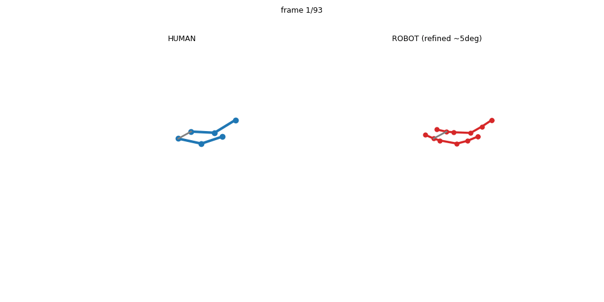

# ImitationNet Reproduction — Unsupervised Human-to-Robot Motion Retargeting

A from-scratch reproduction (no official code released) of:

> **Unsupervised Human-to-Robot Motion Retargeting via Shared Latent Space**, Yan et al., Humanoids 2023 — the human→robot retargeting backbone used by **ECHO** (Robot Interaction Behavior Generation, ICRA 2024).

The model learns to map a **human arm pose → TIAGo++ robot joint angles** through a shared latent space, **without any paired human–robot data**.



*Left: human arm (3 joints/arm). Right: retargeted TIAGo++ arm (full 7-DOF chain). Body-canonicalized so the configurations are directly comparable.*

---

## Result

| Variant | Limb-orientation error | vs random |
|---|---|---|
| Paper-faithful (triplet only) | 82° | 1.5× |
| **+ differentiable-FK loss** | 16.8° | 21× |
| **+ larger latent (32)** | 13.0° | 25× |
| **+ pure-FK feed-forward** | **12.2°** | 28× |
| **+ test-time refinement** | **5.3°** ≈ kinematic floor | — |
| *Reachability floor (per-pose optimization)* | *4.9°* | — |

The retargeting reaches the **physical floor** (~5°, the best the TIAGo++ arm can geometrically do) while staying real-time (~2.5 kHz with refinement).

> The paper's only reported accuracy metric is **joint-angle MSE = 0.21** (vs baseline 0.44), measured against 11 hand-annotated ground-truth robot poses that were **not released**. Our proxy joint-angle MSE is ~0.29–0.40; see [EXPERIMENTS.md](EXPERIMENTS.md) for why joint-angle MSE is confounded by the 7-DOF redundancy and why **limb-orientation error is the meaningful metric**.

---

## Method (paper §III)

Three MLPs (6 hidden layers × 128, shared latent space) + an unsupervised contrastive objective:

```
human pose (4 limbs × 6D rot, 24) ──Q_h──┐
                                          ├──→ shared latent z ──D_r──→ robot joints (14)
robot pose (14 joint angles)     ──Q_r──┘
```

- **S_RD similarity** (paper Eq.1): global rotation of 4 arm limbs (L/R shoulder→elbow, elbow→wrist).
- **Losses** (Eq.2–5): `L_triplet` (α=0.05, λ=10) + `L_rec` (robot autoencoder, λ=5) + `L_ltc` (cycle consistency).
- **Data**: ~15M TIAGo++ poses (sampled from joint limits + FK) + HumanML3D human poses. Unpaired.

### Two unstated/critical fixes we had to discover

1. **Coordinate-system alignment** — the paper claims the global-rotation similarity is "invariant to coordinate systems", but in practice the human (SMPL root frame) and robot (URDF base frame) limb rotations live in **incompatible conventions**; comparing them directly gives random results. Fix: build each limb's rotation frame geometrically from joint positions and **canonicalize into a body frame** (`R_canon = Bᵀ·R_world`).
2. **Random negatives** — the triplet must use a *random* other human as the negative (paper's random triplets), **not** the "most dissimilar" one. The latter makes the α=0.05 margin trivially satisfied, so the latent never aligns.

### Beyond the paper (for accuracy)

The paper's indirect latent alignment plateaus at 82°. Adding a **differentiable forward-kinematics loss** — backprop the limb-orientation mismatch straight through FK — directly optimizes the retargeting objective and drops the error to ~12° (feed-forward) / ~5° (with test-time refinement). This diverges from the paper's pure-unsupervised philosophy (it becomes a learned-init differentiable IK) but is fully documented in [EXPERIMENTS.md](EXPERIMENTS.md).

---

## Repository layout

| File | Purpose |
|---|---|
| `robot_kinematics.py` | TIAGo++ FK (pytorch_kinematics), arm sampling, canonical limb frames |
| `human_repr.py` | HumanML3D loading, canonical limb frames |
| `rotations.py` | 6D↔matrix, geometric limb/body frames, S_RD |
| `similarity.py` | direction-based S_RD (early version) |
| `imitationnet_model.py` | Q_h / Q_r / D_r MLPs |
| `imitationnet_losses.py` | triplet + rec + ltc (Eq.2–5) |
| `generate_robot_bank.py` | sample the ~15M robot-pose bank |
| `train_imitationnet.py` | training (all flags: `--lambda_fk`, `--latent`, `--pure_fk`, …) |
| `eval_retarget.py` | retargeting evaluation |
| `viz_full.py` / `viz_anim.py` / `viz_best.py` | visualizations |
| `EXPERIMENTS.md` | **full experiment log v1–v12 + all findings** |

---

## How to run

Requires the TIAGo++ URDF and HumanML3D dataset (paths set at the top of `human_repr.py` / `robot_kinematics.py`).

```bash
# 1. generate the robot-pose bank (~15M poses, ~2.3 GB, ~2 min)
python generate_robot_bank.py --n 15000000

# 2. train — best feed-forward (pure differentiable-FK)
python train_imitationnet.py --device cuda --steps 80000 \
    --pure_fk --lambda_fk 30 --latent 32 --ckpt checkpoints_imitation_purefk

#    or the paper-faithful version (triplet only)
python train_imitationnet.py --device cuda --steps 30000 --ckpt checkpoints_imitation_rot

# 3. evaluate
python eval_retarget.py

# 4. visualize (static strip + animation, with test-time refinement)
python viz_best.py
```

Environment: PyTorch (CUDA), `pytorch_kinematics`, `matplotlib`, `numpy`.

---

## Notes

- Robot data is **synthetic** (sampled from the URDF configuration space + FK) — there is no downloadable robot-motion dataset.
- The 15M-pose bank (`robot_bank.npz`, ~2.3 GB) is **not committed** — regenerate it with `generate_robot_bank.py`.
- Every experiment, dead-end, and divergence-from-paper is logged honestly in [EXPERIMENTS.md](EXPERIMENTS.md).

🤖 Reproduced with [Claude Code](https://claude.com/claude-code)
